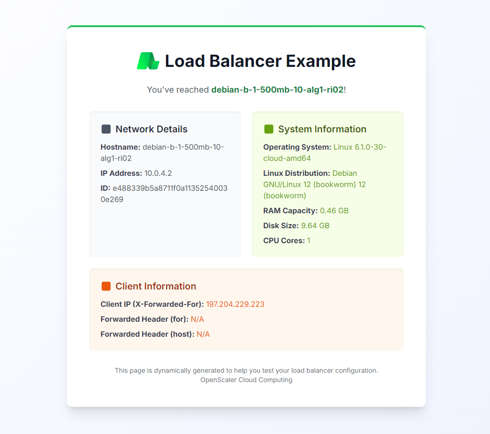

### Load Balancer Demo

OpenScaler **Load Blanacer Demo** is a simple web application made with Flask to help you try out OpenScaler Load Balancer features.



**Table of content**

- [Description](#description)
- [Quickstart](#quickstart)
- [Test Application Locally](#test-application-locally)
- [Install Demo App on Already Existing Computer](#install-demo-app-on-already-existing-computer)

## Quickstart

1. Copy the [cloud-init.config.yaml](cloud-init.config.yaml) file
2. Create one or more computers with [cloud-init.config.yaml](cloud-init.config.yaml) as boot script (under "advanced options")
   - (NOTE: if you don't have a new instance, follow the guide [#install-demo-app-locally])
3. Create a new Load Balancer
4. Add a new backend server to the Load Balancer with the IPs of the computers you created in step 2
   - IMPORTANT: make sure to use port 8080 for your backend
   - Optional: you can configure health check for your backend server
     - use the `/health` endpoint (and keep everything else default; e.g. status code `200` etc.)
   - you can test out other options like `sticky sessions` and `load balancing algorithm` as well
5. Create a new frontend server and select the backend created in step 4 as "default backend"
   - add bind to port `80` (or any port you want)
   - TIP: keep the "Real Client IP" option enabled to see your IP address displayed in the demo app
6. Navigate to "network" tab in your load balancer and forward the port you selected in step 5 (in our case `80`)
7. Done! simply click on the address shown in the table next to your port and you should see the demo app running

Try refreshing the page a few times to see the load balancer in action.

## Test Application Locally

To test the application locally

- On Linux:

```shell
python3 -m venv .venv
source .venv/bin/activate    #
pip install -r requirements.txt
export FLASK_APP=load-balancer-demo.py
flask run --host=0.0.0.0 --port=8080
```

- On Windows:

```shell
python -m venv .venv
.venv/Scripts/activate
pip install -r requirements.txt
$env:FLASK_APP = "load-balancer-demo.py"
flask run --host=0.0.0.0 --port=8080
```

You can now access your application at `http://localhost:8080`

## Install Demo App on Already Existing Computer

If you don't want to create a new instance, you can install the demo app on an already existing computer as follows:

1. copy the content [load-balancer-demo.py](load-balancer-demo.py) to your local machine
2. run the application locally

```shell
python3 -m venv .venv
source .venv/bin/activate    # or .venv/Scripts/activate.fish for fish shell
pip install -r requirements.txt
export FLASK_APP=load-balancer-demo.py
flask run --host=0.0.0.0 --port=8080
```
